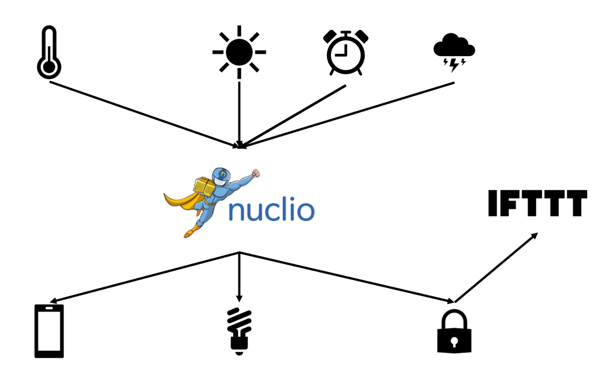
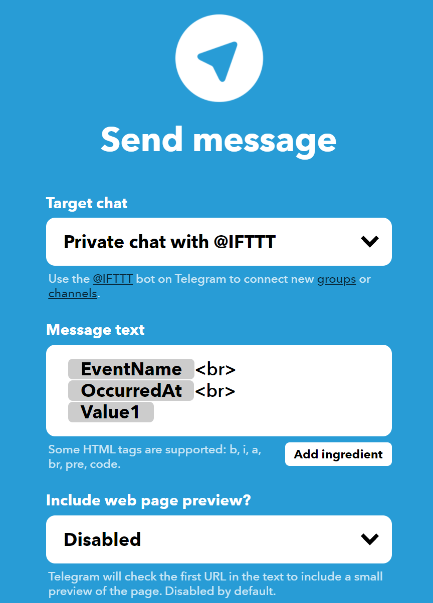

# **Serverless Computing for IoT**

## Serverless

Serverless is a cloud execution model that enables a simpler, more cost-effective way to build and operate cloud-native applications. The serverless model requires no management and operation of infrastructure, giving developers more time to optimize code and develop innovative new features and functionality.

Serverless computing runs code on-demand only, typically in a stateless container, on a pre-request basis, and scales transparently with the number of requests being served. Serverless computing enables end users to pay only for resources being used, never paying for idle capacity.

## IoT

The Internet of Things is the concept of connecting any device (so long as it has an on/off switch) to the Internet and to other connected devices. The IoT is a giant network of connected things and people – all of which collect and share data about the way they are used and about the environment around them.

## Serverless Computing for IoT
Since, serverless technology uses parallel processing and serverless databases ensures that the functions closest to the end device are executed on priority. This makes serverless functions a natural fit for edge computing applications.

Serverless supports the protocols which IoT devices require in actual deployment conditions. For instance, many IoT devices with limited power, such as edge sensors, uses MQTT, a lightweight messaging protocol. All the functions including Lambda and Azure Function have been designed to publish to an MQTT topic.

In the IoT era, you cannot afford downtime, as there are many essential services that depend on the Web, and it will have real world consequences, which means they can come to a grinding halt. Therefore, IoT and serverless computing are a perfect combination.

<br>

# **PoolManager installation**

### **Structure**

* **[PoolManager](#poolmanager)**
* **[Architecture](#architecture)**
* **[Prerequisites](#prerequisites)**
* **[Installation](#installation)**
* **[Run Project](#run-project)**

<br>
<br>


## **PoolManager**

PoolManager is a project that wants to show the potential of the IoT and the Serverless approach for the simplification of daily life actions such as the management of a swimming pool.

More precisely, the system collects data from various sensors (temperature, rain and light sensor) to manage the motorized closing and opening of the pool and its lighting.

In relation to the temperature, the pool will close if the outside temperature is below 0 degrees to prevent the water from freezing and will reopen if the temperature returns to above 10 degrees.

In relation to rain, the pool closes when rain is detected to preserve the cleanliness of the water.

The pool will be automatically opened and closed at the chosen times.

Finally, in relation to the light, it will be related to the presence or absence of the sun and to the opening or closing of the roof.

When the pool is closed or opened, a notice will be sent to the customer via Telegram.

Everything that happens can be viewed above a connected tablet or smartphone.  

<br>

The application is composed by eight functions:

* **[PoolManager](#poolmanager-function)**, is triggered by a new MQTT message on topics "iot/sensors/temperature", "iot/sensors/light" and "iot/sensors/rain".
* **[Temperature Sensor](#send-random-temperature-function)**, sends a new temperature value on the MQTT topic "iot/sensors/temperature" once a minute.
* **[Light Sensor](#send-random-sun-function)**, sends a new temperature value on the MQTT topic "iot/sensors/sun" once a minute.
* **[Timer](#timer-function)**, sends Hour and minutes on the MQTT topic "iot/sensors/time" once a minute.
* **[Rain Sensor](#send-random-rain-function)**, sends a new temperature value on the MQTT topic "iot/sensors/rain" once a minute.
* **[App](#app)**, a general purpose Android MQTT Client subcribed to "iot/devices/app" to show to the user what is happening on "iot/devices/info" topic.
* **[Cover](#cover)**, simulates the behavior of the pool cover. This functions is subscribed to "iot/devices/cover". Is a JavaScript function for Node.js and is executed on an external machine. When the cover open or close it trigger an IFTT event to send information on telegram.
* **[Light](#light)**, simulates the behavior of the light bulb. This functions is subscribed to "iot/devices/light".  Is a JavaScript function for Node.js and is executed on an external machine.

The first step to do is access to the Nuclio dashboard and create a new project. (you can set your preferd name)

<br>

## **Architecture**

<p align="center"></p>

- The **temperature sensor** sends temperature to nuclio function (sensor writes new temperature on **iot/sensors/temperature** queue) 
- The **rain sensor** sends the occurring of the rain to nuclio function (sensor writes new temperature on **iot/sensors/rain** queue) 
- The **light sensor** sends the presence of light to nuclio function (sensor writes new temperature on **iot/sensors/sun** queue) 
- The **timer** sends the current hour to nuclio function (sensor writes hour on **iot/sensors/time** queue) 
- When arrives messages on "iot/sensors/temperature" the **nuclio function** is triggered and takes an action (eg. if the temperature is to low or enough high writes on iot/devices/cover topic)
- When arrives messages on "iot/sensors/rain" the **nuclio function** is triggered and takes an action (eg. if it's raining writes on iot/devices/cover topic)
- When arrives messages on "iot/sensors/time" the **nuclio function** is triggered and compare the current hour with closing hour and opening hour
- When arrives messages on "iot/sensors/sun" the **nuclio function** is triggered and takes an action (eg. if there is enough light or if there isn't enough light writes on iot/devices/light topic)
- The **cover**  recieves the command from messages to start itself
  - if the cover is closed (or opened) is **triggered an iftt event** to send a telegram message to the user
- The **nuclio funtion also writes on iot/devices/app to log** what is happening
  
  
<br>

## **Prerequisites**
- OS: 
    - Ubuntu 21.04 LTS
- Software:
    - Docker and Docker Compose (Application containers engine)
    - Nuclio (Serverless computing provider)
    - RabbitMQ (AMQP and MQTT message broker)
    - Node.js
- Service:
  - IFTT account 

<br>

## **Installation**

This project is made on top of one local machine an Linux Ubuntu 21.04 LTS machine. 

<br>

### Docker

Docker is a tool designed to make it easier to create, deploy, and run applications by using containers.
 

### Install Docker using the Docker CE installation [guide](https://docs.docker.com/engine/install/ubuntu/).

<br>

#### Set up the repository:

- Update the apt package index and install packages to allow apt to use a repository over HTTPS:

    ```sh
    sudo apt-get update

    sudo apt-get install \
        apt-transport-https \
        ca-certificates \
        curl \
        gnupg \
        lsb-release
    ```

- Add Docker’s official GPG key:

    ```sh
    curl -fsSL https://download.docker.com/linux/ubuntu/gpg | sudo gpg --dearmor -o /usr/share/keyrings/docker-archive-keyring.gpg

    ```

- Use the following command to set up the stable repository. To add the nightly or test repository, add the word nightly or test (or both) after the word stable in the commands below. Learn about nightly and test channels.

    ```sh
    $echo \
    "deb [arch=amd64 signed-by=/usr/share/keyrings/docker-archive-keyring.gpg] https://download.docker.com/linux/ubuntu \
    $(lsb_release -cs) stable" | sudo tee /etc/apt/sources.list.d/docker.list > /dev/null

    ```
<br>

#### Install Docker Engine:

- Update the apt package index, and install the latest version of Docker Engine and containerd, or go to the next step to install a specific version:
  
    ```sh
    sudo apt-get update
    sudo apt-get install docker-ce docker-ce-cli containerd.io
    ```
    
    <br>

---------------------------------------------------------------------------------------------------------------------------- 
### Docker Compose

Compose is a tool for defining and running multi-container Docker applications. With Compose, you use a YAML file to configure your application’s services.

Install Docker Compose using the Docker Compose installation [guide](https://docs.docker.com/compose/install/#install-compose).

```sh
sudo curl -L "https://github.com/docker/compose/releases/download/1.22.0/docker-compose-$(uname -s)-$(uname -m)" -o /usr/local/bin/docker-compose
sudo chmod +x /usr/local/bin/docker-compose
```
<br>

------------------------------------------------------------------------------------------------------------------------------
### Nuclio 

The Nuclio documentation is available at [this link](https://nuclio.io/docs/latest/).

Start [Nuclio](https://github.com/nuclio/nuclio) using a docker container.

```sh
sudo docker run -p 8070:8070 -v /var/run/docker.sock:/var/run/docker.sock -v /tmp:/tmp nuclio/dashboard:stable-amd64
```

Browse to http://localhost:8070, create a project, and add a function. When run outside of an orchestration platform (for example, Kubernetes or Swarm), the dashboard will simply deploy to the local Docker daemon.

<br>

----------------------------------------------------------------------------------------------------------------------------

### RabbitMQ 

Start [RabbitMQ](https://www.rabbitmq.com) instance with MQTT enabled using docker.

```sh
sudo docker run -p 9000:15672  -p 1883:1883 -p 5672:5672  cyrilix/rabbitmq-mqtt 
```

Browse to http://localhost:9000, and login using username: guest and password: guest, to access to the RabbitMQ managment, where is possible to visualize the message queues and the broker status.

<br>

----------------------------------------------------------------------------------------------------------------------------

### IFTT MAIL TRIGGER 

Create an [IFTT](https://ifttt.com) account.

Then you need to create a new Applet:

- Set this name to Event Name: _"triggerIot"_
- Use WebHooks in _"if"_ section:
<p align=center> </p>

- Use Gmail in _"then"_ section:
<p align=center>  </p>

- Set the Telegram account:
<p align=center> </p>

- Save your key to call the http request from node functions


<br>

------------------------------------------------------------------------------------------------------------------------------

### Library for MQTT clients

There are different libraries for many languages for interacting with protocol MQTT you can use what you want. For JavaScript MQTT you can use this [library](https://github.com/mqttjs/MQTT.js#readme).

<br>

### Library for <i>.env</i> file

[Dotenv](https://github.com/motdotla/dotenv#readme) is a zero-dependency module that loads environment variables from a .env file into process.env. Storing configuration in the environment separate from code is based on The Twelve-Factor App methodology. 

<br>
  
### Library to make HTTP request used in the project to trigger mail event on IFTT
[Request](https://github.com/request/request#readme) is designed to be the simplest way possible to make http calls. It supports HTTPS and follows redirects by default.

<br>

### MQTT Android Clients

General purpose [MQTT client](https://play.google.com/store/apps/details?id=com.gbn.mqttclient) for Android.

<br>

-----------------------------------------------------------------------------------------------------------------------------

<br>

## **Run Project**

<br>

### Set _".env"_ file

**First of all you need to create a file _".env"_ in _"principal"_ directory and add:**

```
    IFTT_KEY = YOUR_IFTT_KEY
    IP = YOUR_IP
```

_(You need to set your key and your ip before saving the file.)_

<br>

### Temperature Handler Function

The PoolManager Function is written in pure JavaScript and exploits the _mqtt_ JavaScript library to communicate on the "iot/devices/cover", "iot/devices/light" and "iot/devices/app" topics the invocation of the function. 
The JavaScript code is [here](src/nuclio_functions/PoolManagerMqtt-nuclio.js)

The function is deployed using the Docker compose specifics for Nuclio. This is achieved by define a new yaml file that declares all functions specifications and source code. The source code of the function (the JavaScript code) is encoded in base64 and copied in the attribute "functionSourceCode",  moreover, is defined a new trigger on the mqtt protocol that allows to automatically call the function when a new message is coming on the topic "iot/sensors/temperature". Since the functions exploits the mqtt in the "commands" attribute is added the command to install on Node.js the mqtt (npm install mqtt).

```yaml
metadata:
  name: poolmanagermqtt
  labels:
    nuclio.io/project-name: iot-mqtt
spec:
  handler: "main:handler"
  runtime: nodejs
  resources: {}
  image: "nuclio/processor-poolmanagermqtt:latest"
  minReplicas: 1
  maxReplicas: 1
  targetCPU: 75
  triggers:
   
    rain:
      class: ""
      kind: mqtt
      url: "guest:guest@192.168.225.162:1883"
      attributes:
        subscriptions:
          - qos: 2
            topic: iot/sensors/rain
    sun:
      class: ""
      kind: mqtt
      url: "guest:guest@192.168.225.162:1883"
      attributes:
        subscriptions:
          - qos: 2
            topic: iot/sensors/light
    temperature:
      class: ""
      kind: mqtt
      url: "guest:guest@192.168.225.162:1883"
      attributes:
        subscriptions:
          - qos: 2
            topic: iot/sensors/temperature
     time:
      class: ""
      kind: mqtt
      url: "guest:guest@192.168.225.162:1883"
      attributes:
        subscriptions:
          - qos: 2
            topic: iot/sensors/time
  build:
    functionSourceCode: dmFyIG1xdHQgPSByZXF1aXJlKCdtcXR0Jyk7DQoNCmNvbnN0IEZVTkNUSU9OX05BTUUgPSAicG9vbG1hbmFnZXJtcXR0IjsNCi8vIFRPRE86IFNFVCBIRVJFIFlPVVIgTE9DQUwgSVANCmNvbnN0IElQID0gIjE5Mi4xNjguMjI1LjE2MjoxODgzIg0KY29uc3QgTElHSFRfVE9QSUMgPSAiaW90L2RldmljZXMvbGlnaHQiDQpjb25zdCBDT1ZFUl9UT1BJQyA9ICJpb3QvZGV2aWNlcy9jb3ZlciINCmNvbnN0IFBIT05FX1RPUElDID0gImlvdC9kZXZpY2VzL2FwcCINCmNvbnN0IENPTE9SX1RPUElDID0gImlvdC9kZXZpY2VzL2NvbG9yIg0KDQovL01pbiBwb29sIHRlbXBlcmF0dXJlDQpjb25zdCBNSU5fVEVNUEVSQVRVUkUgPSAxMA0KDQoNCnZhciBvcHRpb25zID0gew0KICAgIGhvc3Q6ICdtcXR0Oi8vJyArIElQLA0KICAgIGNsaWVudElkOiAnbXF0dGpzXycgKyBNYXRoLnJhbmRvbSgpLnRvU3RyaW5nKDE2KS5zdWJzdHIoMiwgOCksDQogICAgdXNlcm5hbWU6ICdndWVzdCcsDQogICAgcGFzc3dvcmQ6ICdndWVzdCcsDQp9Ow0KDQp2YXIgcG93ZXIgPSAibGlnaHRfb24iDQp2YXIgY29sb3IgPSAiI0ZGRkZGRiINCnZhciByYWluID0gIm5vdF9yYWluIg0KdmFyIGNvdmVyID0gImNvdmVyX29mZiINCnZhciBzdW4gPSAieWVzIg0KdmFyIGRlc2NyaXB0aW9uID0gIm5vIg0KdmFyIHRlbXBlcmF0dXJlID0gMjUNCg0KYXN5bmMgZnVuY3Rpb24gc2VuZF90b19vbmVfdG9waWNfbXF0dCh0b3BpYywgZGF0YSkgew0KICAgIHZhciBjbGllbnQgPSBtcXR0LmNvbm5lY3QoIm1xdHQ6Ly8iICsgSVAsIG9wdGlvbnMpOw0KICAgIGNsaWVudC5vbignY29ubmVjdCcsIGZ1bmN0aW9uICgpIHsNCiAgICAgICAgY2xpZW50LnB1Ymxpc2godG9waWMsIGRhdGEsIGZ1bmN0aW9uICgpIHsNCiAgICAgICAgICAgIGNsaWVudC5lbmQoKTsNCiAgICAgICAgfSk7DQogICAgfSk7DQp9DQphc3luYyBmdW5jdGlvbiBzZW5kX3RvX3R3b190b3BpY19tcXR0KHRvcGljMSwgdG9waWMyLCBkYXRhMSwgZGF0YTIpIHsNCiAgICB2YXIgY2xpZW50ID0gbXF0dC5jb25uZWN0KCJtcXR0Oi8vIiArIElQLCBvcHRpb25zKTsNCiAgICBjbGllbnQub24oJ2Nvbm5lY3QnLCBmdW5jdGlvbiAoKSB7DQogICAgICAgIGNsaWVudC5wdWJsaXNoKHRvcGljMSwgZGF0YTEsIGZ1bmN0aW9uICgpIHsNCiAgICAgICAgICAgIGNsaWVudC5wdWJsaXNoKHRvcGljMiwgZGF0YTIsIGZ1bmN0aW9uICgpIHsNCiAgICAgICAgICAgICAgICBjbGllbnQuZW5kKCk7DQogICAgICAgICAgICB9KTsNCiAgICAgICAgfSk7DQogICAgfSk7DQp9DQphc3luYyBmdW5jdGlvbiBzZW5kX3RvX3RocmVlX3RvcGljX21xdHQodG9waWMxLCB0b3BpYzIsIHRvcGljMywgZGF0YTEsIGRhdGEyLCBkYXRhMykgew0KICAgIHZhciBjbGllbnQgPSBtcXR0LmNvbm5lY3QoIm1xdHQ6Ly8iICsgSVAsIG9wdGlvbnMpOw0KICAgIGNsaWVudC5vbignY29ubmVjdCcsIGZ1bmN0aW9uICgpIHsNCiAgICAgICAgY2xpZW50LnB1Ymxpc2godG9waWMxLCBkYXRhMSwgZnVuY3Rpb24gKCkgew0KICAgICAgICAgICAgY2xpZW50LnB1Ymxpc2godG9waWMyLCBkYXRhMiwgZnVuY3Rpb24gKCkgew0KICAgICAgICAgICAgICAgIGNsaWVudC5wdWJsaXNoKHRvcGljMywgZGF0YTMsIGZ1bmN0aW9uICgpIHsNCiAgICAgICAgICAgICAgICAgICAgY2xpZW50LmVuZCgpOw0KICAgICAgICAgICAgICAgIH0pOw0KICAgICAgICAgICAgfSk7DQogICAgICAgIH0pOw0KICAgIH0pOw0KfQ0KYXN5bmMgZnVuY3Rpb24gc2VuZF90b19mb3VyX3RvcGljX21xdHQodG9waWMxLCB0b3BpYzIsIHRvcGljMyx0b3BpYzQsIGRhdGExLCBkYXRhMiwgZGF0YTMsZGF0YTQpIHsNCiAgICB2YXIgY2xpZW50ID0gbXF0dC5jb25uZWN0KCJtcXR0Oi8vIiArIElQLCBvcHRpb25zKTsNCiAgICBjbGllbnQub24oJ2Nvbm5lY3QnLCBmdW5jdGlvbiAoKSB7DQogICAgICAgIGNsaWVudC5wdWJsaXNoKHRvcGljMSwgZGF0YTEsIGZ1bmN0aW9uICgpIHsNCiAgICAgICAgICAgIGNsaWVudC5wdWJsaXNoKHRvcGljMiwgZGF0YTIsIGZ1bmN0aW9uICgpIHsNCiAgICAgICAgICAgICAgICBjbGllbnQucHVibGlzaCh0b3BpYzMsIGRhdGEzLCBmdW5jdGlvbiAoKSB7DQogICAgICAgICAgICAgICAgICAgIGNsaWVudC5wdWJsaXNoKHRvcGljNCwgZGF0YTQsIGZ1bmN0aW9uICgpIHsNCiAgICAgICAgICAgICAgICAgICAgICAgIGNsaWVudC5lbmQoKTsNCiAgICAgICAgICAgICAgICAgICAgfSk7DQogICAgICAgICAgICAgICAgfSk7DQogICAgICAgICAgICB9KTsNCiAgICAgICAgfSk7DQogICAgfSk7DQp9DQpmdW5jdGlvbiBiaW4yc3RyaW5nKGFycmF5KSB7DQogICAgdmFyIHJlc3VsdCA9ICIiOw0KICAgIGZvciAodmFyIGkgPSAwOyBpIDwgYXJyYXkubGVuZ3RoOyArK2kpIHsNCiAgICAgICAgcmVzdWx0ICs9IChTdHJpbmcuZnJvbUNoYXJDb2RlKGFycmF5W2ldKSk7DQogICAgfQ0KICAgIHJldHVybiByZXN1bHQ7DQp9DQoNCmV4cG9ydHMuaGFuZGxlciA9IGZ1bmN0aW9uIChjb250ZXh0LCBldmVudCkgew0KICAgIHZhciBfZXZlbnQgPSBKU09OLnBhcnNlKEpTT04uc3RyaW5naWZ5KGV2ZW50KSk7DQogICAgdmFyIF9kYXRhID0gYmluMnN0cmluZyhfZXZlbnQuYm9keS5kYXRhKTsNCiAgICANCiAgDQogICAgDQogICAgaWYoX2RhdGE9PSJyYWluIiAmJiBjb3Zlcj09ImNvdmVyX29mZiIpew0KICAgIAlpZihwb3dlcj09ImxpZ2h0X29uIil7DQogICAgICAgICAgCXBvd2VyPSJsaWdodF9vZmYiDQogICAgCQljb3Zlcj0iY292ZXJfb24iDQogICAgICAgCQlzZW5kX3RvX3RocmVlX3RvcGljX21xdHQoQ09WRVJfVE9QSUMsIExJR0hUX1RPUElDLFBIT05FX1RPUElDLCBjb3ZlciwgcG93ZXIsIkl0J3Mgc3RhcnRpbmcgdG8gcmFpbiEgSSBjbG9zZSB0aGUgcG9vbC4iKQ0KICAgICAgIAkJY29udGV4dC5jYWxsYmFjaygiZmVlZGJhY2sge3RlbXBlcmF0dXJlOiAiICsgdGVtcGVyYXR1cmUgKyAiLCBjb3ZlcjogIiArIGNvdmVyICsgIiwgbGlnaHQ6ICIgKyBwb3dlciArICJ9IikNCiAgICAgICAJfWVsc2V7DQogICAgICAgCQljb3Zlcj0iY292ZXJfb24iDQogICAgICAgCQlzZW5kX3RvX3R3b190b3BpY19tcXR0KENPVkVSX1RPUElDLFBIT05FX1RPUElDLGNvdmVyLCJJdCdzIHN0YXJ0aW5nIHRvIHJhaW4hIEkgY2xvc2UgdGhlIHBvb2wuIikNCiAgICAgICAJCWNvbnRleHQuY2FsbGJhY2soImZlZWRiYWNrIHt0ZW1wZXJhdHVyZTogIiArIHRlbXBlcmF0dXJlICsgIiwgY292ZXI6ICIgKyBjb3ZlciArICIsIGxpZ2h0OiAiICsgcG93ZXIgKyAifSIpDQogICAgICAgICAgIH0NCiAgICB9DQoNCmlmKF9kYXRhPT0ibm90X3JhaW4iICYmIGNvdmVyPT0iY292ZXJfb24iICYmIHRlbXBlcmF0dXJlPk1JTl9URU1QRVJBVFVSRSl7DQogICAgCWlmKHN1bj09Im5vIiAmJiBwb3dlcj09ImxpZ2h0X29mZiIpew0KICAgIAkJcG93ZXI9ImxpZ2h0X29uIg0KICAgIAkJY292ZXI9ImNvdmVyX29mZiINCiAgICAgICAJCXNlbmRfdG9fZm91cl90b3BpY19tcXR0KENPVkVSX1RPUElDLCBMSUdIVF9UT1BJQyxDT0xPUl9UT1BJQyxQSE9ORV9UT1BJQywgY292ZXIsIHBvd2VyLGNvbG9yLCJUaGUgcmFpbiBpcyBvdmVyISBJIHJlb3BlbiB0aGUgcG9vbC4iKQ0KICAgICAgIAkJY29udGV4dC5jYWxsYmFjaygiZmVlZGJhY2sge3RlbXBlcmF0dXJlOiAiICsgdGVtcGVyYXR1cmUgKyAiLCBjb3ZlcjogIiArIGNvdmVyICsgIiwgbGlnaHQ6ICIgKyBwb3dlciArICJ9IikNCiAgICAgICAJfWVsc2V7DQogICAgICAgCQljb3Zlcj0iY292ZXJfb2ZmIg0KICAgICAgIAkJc2VuZF90b190d29fdG9waWNfbXF0dChDT1ZFUl9UT1BJQyxQSE9ORV9UT1BJQyxjb3ZlciwiVGhlIHJhaW4gaXMgb3ZlciEgSSByZW9wZW4gdGhlIHBvb2wuIikNCiAgICAgICAJCWNvbnRleHQuY2FsbGJhY2soImZlZWRiYWNrIHt0ZW1wZXJhdHVyZTogIiArIHRlbXBlcmF0dXJlICsgIiwgY292ZXI6ICIgKyBjb3ZlciArICIsIGxpZ2h0OiAiICsgcG93ZXIgKyAifSIpDQogICAgICAgfQ0KICAgIH0NCiAgIGlmKGNvdmVyPT0iY292ZXJfb24iICYmIHBvd2VyPT0ibGlnaHRfb24iKXsNCiAgICBwb3dlcj0ibGlnaHRfb2ZmIg0KICAgICBzZW5kX3RvX29uZV90b3BpY19tcXR0KExJR0hUX1RPUElDLHBvd2VyKSAgIA0KICAgIH0NCiAgICANCiAgICBpZighaXNOYU4oX2RhdGEpKXsNCgkgICAgdGVtcGVyYXR1cmU9IE51bWJlcihfZGF0YSkNCiAgICAgICAgICANCgkgICAgaWYodGVtcGVyYXR1cmU8TUlOX1RFTVBFUkFUVVJFICYmIGNvdmVyPT0iY292ZXJfb2ZmIil7DQogICAgICAgICAgICANCiAgICAgICAgIAlpZihwb3dlcj09ImxpZ2h0X29uIil7DQoJICAgIAkJcG93ZXI9ImxpZ2h0X29mZiINCgkgICAgCQljb3Zlcj0iY292ZXJfb24iDQoJICAgICAgIAkJc2VuZF90b190aHJlZV90b3BpY19tcXR0KENPVkVSX1RPUElDLCBMSUdIVF9UT1BJQyxQSE9ORV9UT1BJQyAsY292ZXIsIHBvd2VyLCJUaGUgdGVtcGVyYXR1cmUgaXMgdG9vIGxvdyEgSSBjbG9zZSB0aGUgcG9vbC4iKQ0KCSAgICAgICAJCWNvbnRleHQuY2FsbGJhY2soImZlZWRiYWNrIHt0ZW1wZXJhdHVyZTogIiArIHRlbXBlcmF0dXJlICsgIiwgY292ZXI6ICIgKyBjb3ZlciArICIsIGxpZ2h0OiAiICsgcG93ZXIgKyAifSIpDQoJICAgICAgIAl9ZWxzZXsNCgkgICAgICAgCQljb3Zlcj0iY292ZXJfb24iDQoJICAgICAgIAkJc2VuZF90b190d29fdG9waWNfbXF0dChDT1ZFUl9UT1BJQyxQSE9ORV9UT1BJQyxjb3ZlciwiVGhlIHRlbXBlcmF0dXJlIGlzIHRvbyBsb3chIEkgY2xvc2UgdGhlIHBvb2wuIikNCgkgICAgICAgCQljb250ZXh0LmNhbGxiYWNrKCJmZWVkYmFjayB7dGVtcGVyYXR1cmU6ICIgKyB0ZW1wZXJhdHVyZSArICIsIGNvdmVyOiAiICsgY292ZXIgKyAiLCBsaWdodDogIiArIHBvd2VyICsgIn0iKQ0KCSAgICAgICB9DQoJICAgIH0NCiAgICAgICAgaWYodGVtcGVyYXR1cmU+TUlOX1RFTVBFUkFUVVJFICYmIGNvdmVyPT0iY292ZXJfb24iKXsNCiAgICAgICAgICAgIA0KICAgICAgICAgCWlmKHBvd2VyPT0ibGlnaHRfb2ZmIiAmJiBzdW49PSJubyIpew0KCSAgICAJCXBvd2VyPSJsaWdodF9vbiINCgkgICAgCQljb3Zlcj0iY292ZXJfb2ZmIg0KCSAgICAgICAJCXNlbmRfdG9fdGhyZWVfdG9waWNfbXF0dChDT1ZFUl9UT1BJQywgTElHSFRfVE9QSUMsUEhPTkVfVE9QSUMsIGNvdmVyLCBwb3dlciwiVGhlIHRlbXBlcmF0dXJlIGhhcyByaXNlbiEgSSByZW9wZW4gdGhlIHBvb2wuICIpDQoJICAgICAgIAkJY29udGV4dC5jYWxsYmFjaygiZmVlZGJhY2sge3RlbXBlcmF0dXJlOiAiICsgdGVtcGVyYXR1cmUgKyAiLCBjb3ZlcjogIiArIGNvdmVyICsgIiwgbGlnaHQ6ICIgKyBwb3dlciArICJ9IikNCgkgICAgICAgCX1lbHNlew0KCSAgICAgICAJCWNvdmVyPSJjb3Zlcl9vZmYiDQoJICAgICAgIAkJc2VuZF90b190d29fdG9waWNfbXF0dChDT1ZFUl9UT1BJQyxQSE9ORV9UT1BJQyxjb3ZlciwiVGhlIHRlbXBlcmF0dXJlIGhhcyByaXNlbiEgSSByZW9wZW4gdGhlIHBvb2wuIikNCgkgICAgICAgCQljb250ZXh0LmNhbGxiYWNrKCJmZWVkYmFjayB7dGVtcGVyYXR1cmU6ICIgKyB0ZW1wZXJhdHVyZSArICIsIGNvdmVyOiAiICsgY292ZXIgKyAiLCBsaWdodDogIiArIHBvd2VyICsgIn0iKQ0KCSAgICAgICB9DQoJICAgIH0NCiAgICANCiAgICB9DQogICAgDQogICAgDQogICAgaWYoX2RhdGE9PSJ5ZXMiICYmIHN1bj09Im5vIil7DQogICAgCXN1bj0ieWVzIg0KICAgIAlpZihwb3dlcj09ImxpZ2h0X29uIil7DQogICAgCQlwb3dlcj0ibGlnaHRfb2ZmIg0KICAgIAkJc2VuZF90b19vbmVfdG9waWNfbXF0dChMSUdIVF9UT1BJQyxQSE9ORV9UT1BJQyxwb3dlciwiSXQncyBzdW5ueSEgSSB0dXJuIG9mZiB0aGUgbGlnaHRzLiIpDQogICAgCQljb250ZXh0LmNhbGxiYWNrKCJmZWVkYmFjayB7dGVtcGVyYXR1cmU6ICIgKyB0ZW1wZXJhdHVyZSArICIsIGNvdmVyOiAiICsgY292ZXIgKyAiLCBsaWdodDogIiArIHBvd2VyICsgIn0iKQ0KICAgIAl9DQogICAgfQ0KICAgIA0KICAgIGlmKF9kYXRhPT0ibm8iICYmIHN1bj09InllcyIpew0KICAgIAlzdW49Im5vIg0KICAgIAlpZihwb3dlcj09ImxpZ2h0X29mZiIgJiYgY292ZXI9PSJjb3Zlcl9vZmYiKXsNCiAgICAJCXBvd2VyPSJsaWdodF9vbiINCiAgICAJCXNlbmRfdG9fdGhyZWVfdG9waWNfbXF0dChMSUdIVF9UT1BJQyxDT0xPUl9UT1BJQyxQSE9ORV9UT1BJQyxwb3dlcixjb2xvciwiVGhlcmUgaXMgbm90IHRoZSBzdW4hIEkgdHVybiBvbiB0aGUgbGlnaHRzLiIpDQogICAgCQljb250ZXh0LmNhbGxiYWNrKCJmZWVkYmFjayB7dGVtcGVyYXR1cmU6ICIgKyB0ZW1wZXJhdHVyZSArICIsIGNvdmVyOiAiICsgY292ZXIgKyAiLCBsaWdodDogIiArIHBvd2VyICsgIn0iKQ0KICAgIAl9DQogICAgfQ0KICAgIA0KICAgIGlmKF9kYXRhPT0ibGlnaHRfb24iICYmIGNvdmVyPT0iY292ZXJfb2ZmIil7DQogICAgCQlwb3dlcj0ibGlnaHRfb24iDQogICAgCQlzZW5kX3RvX3R3b190b3BpY19tcXR0KExJR0hUX1RPUElDLENPTE9SX1RPUElDLHBvd2VyLGNvbG9yKQ0KICAgIAkJY29udGV4dC5jYWxsYmFjaygiZmVlZGJhY2sge3RlbXBlcmF0dXJlOiAiICsgdGVtcGVyYXR1cmUgKyAiLCBjb3ZlcjogIiArIGNvdmVyICsgIiwgbGlnaHQ6ICIgKyBwb3dlciArICJ9IikNCiAgICB9DQogICAgaWYoX2RhdGE9PSJsaWdodF9vZmYiICYmIHBvd2VyPT0ibGlnaHRfb24iKXsNCiAgICAJcG93ZXI9ImxpZ2h0X29mZiINCiAgICAJc2VuZF90b19vbmVfdG9waWNfbXF0dChMSUdIVF9UT1BJQyxwb3dlcikNCiAgICAJY29udGV4dC5jYWxsYmFjaygiZmVlZGJhY2sge3RlbXBlcmF0dXJlOiAiICsgdGVtcGVyYXR1cmUgKyAiLCBjb3ZlcjogIiArIGNvdmVyICsgIiwgbGlnaHQ6ICIgKyBwb3dlciArICJ9IikNCiAgICB9DQp9
    commands:
      - 'npm install mqtt'
    runtimeAttributes:
      repositories: []
    codeEntryType: sourceCode
  platform: {}
  readinessTimeoutSeconds: 50
  version: 1
```

To deploy the function: 
1. Set your IP in the url of _yaml_ file
2. Create a new project on Nuclio
3. Access, from the Nuclio dashboard, to the project _YOUR-PROJECT-NAME_ and create new function. 
4. When the system ask to create new function you have to select the import form yaml
5. Load the file "src/sensors/poolmanagermqtt.yaml".
At this point the dashboard show you the function IDE where it is needed to deploy on the system the function pressing the button _"Deploy"_.

The same procedure could be achieved but create new function and copy the JavaScript code in the edidor part, and create the new trigger for the MQTT messages.

<br>

### Send Random Temperature Function
The Send Random Temperature Function is written in pure JavaScript and exploits the _MQTT.js_ JavaScript library to communicate on the topic "iot/sensors/temperature".

The JavaScript code is [here](src/sensors/mqttrandomtemperature.js)

The following commands execute the temperature sensor simulation:

```sh
  cd src/sensors/
  npm install
  node mqttrandomtemperature.js
  cd ../..
```
<br>


### Send Random Rain Function
The Send Random Temperature Function is written in pure JavaScript and exploits the _MQTT.js_ JavaScript library to communicate on the topic "iot/sensors/rain".

The JavaScript code is [here](src/sensors/mqttrandomrain.js)

The following commands execute the temperature sensor simulation:

```sh
  cd src/sensors/
  npm install
  node mqttrandomrain.js
  cd ../..
```
<br>


### Send Random Sun Function
The Send Random Sun Function is written in pure JavaScript and exploits the _MQTT.js_ JavaScript library to communicate on the topic "iot/sensors/sun".

The JavaScript code is [here](src/sensors/mqttrandomsun.js)

The following commands execute the temperature sensor simulation:

```sh
  cd src/sensors/
  npm install
  node mqttrandomsun.js
  cd ../..
```
<br>

### Timer Function
The Timer Function is written in pure JavaScript and exploits the _MQTT.js_ JavaScript library to communicate on the topic "iot/sensors/time".

The JavaScript code is [here](src/sensors/mqtttimer.js)

The following commands execute the temperature sensor simulation:

```sh
  cd src/sensors/
  npm install
  node mqtttimer.js
  cd ../..
```
<br>

### App

The tablet function is written in pure JavaScript and exploits the _mqtt_ JavaScript library to receive messages on the queue "iot/devices/app". 
The code is [here](src/devices/app.js)


The following commands execute the tablet simulation:

```sh
  cd src/devices/
  npm install
  node app.js
```

<br>

### Cover

The conditioner function is written in pure JavaScript and exploits the _mqtt_ JavaScript library to receive messages on the queue "iot/devices/cover". 
The code is [here](src/devices/cover.js)

The following commands execute the conditioner simulation:

```sh
  cd src/devices/
  npm install
  node cover.js
```

<br>

### Light

The thermostat function is written in pure JavaScript and exploits the _mqtt_ JavaScript library to receive messages on the queue "iot/devices/light". 
The code is [here](src/devices/light.js)

The following commands execute the thermostat simulation:

```sh
  cd src/devices/
  npm install
  node light.js
  cd ../..
```

<br>

### IoT Client

The IoT Client could be written in any language for any platform that support the MQTT protocol. For this example we have used a general purpose  [MQTT Dashboard](https://play.google.com/store/apps/details?id=com.app.vetru.mqttdashboard). In this app you can subscribe to a topic. (In our case you have to subscribe to "iot/devices/info"). After created the connection you can easily recieve values on this (or other) topic.

<br>
